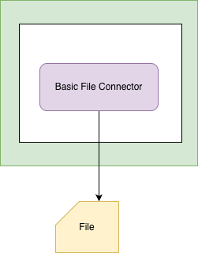
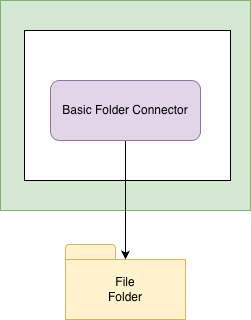

<!-- SPDX-License-Identifier: CC-BY-4.0 -->
<!-- Copyright Contributors to the ODPi Egeria project 2020. -->

# Basic File Connectors

The basic file connectors are used to read and write to files and folders using the Java File object.

## Basic File Connector

The basic file connector provides support to read and write to a file using the Java File object.

## Basic Folder Connector

The basic folder resource connector provides support to read and write the files in a folder (directory) using the Java File object.

----
Return to the [file-connectors](..) module.

----
License: [CC BY 4.0](https://creativecommons.org/licenses/by/4.0/),
Copyright Contributors to the ODPi Egeria project.