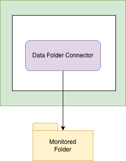

<!-- SPDX-License-Identifier: CC-BY-4.0 -->
<!-- Copyright Contributors to the ODPi Egeria project. -->

# Data Folder connector

The Data Folder resource connector provides support to read and write the files in a folder (directory) using the Java File object.  The files are assumed to holder the records of a single data source represented by the folder.

----
Return to the [file-connectors](..) module.

----
License: [CC BY 4.0](https://creativecommons.org/licenses/by/4.0/),
Copyright Contributors to the ODPi Egeria project.