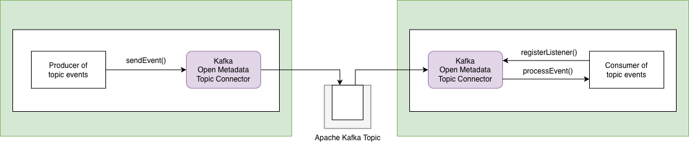

<!-- SPDX-License-Identifier: CC-BY-4.0 -->
<!-- Copyright Contributors to the ODPi Egeria project. -->


  
# Kafka Open Metadata Topic Connector

[Apache Kafka](https://kafka.apache.org/) provides a publish-subscribe service that allows a producer to publish events to subscribed consumers.  Events are organized into topics.  A producer publishes an event to a topic and the consumers register a listener to receive all events from a topic.

The Kafka Open Metadata Topic Connector implements an [Open Metadata Topic Connector](https://egeria-project.org/concepts/open-metadata-topic-connector) for a `PLAINTEXT` Apache Kafka topic.  It supports both the event producer and event consumer interfaces.



Egeria uses this connector as its default event notification technology (known as the [Event Bus](https://egeria-project.org/concepts/event-bus)).  You may also use it in your [integration connectors](https://egeria-project.org/concepts/integration-connector) is they need to send or receive events from a third party technology.

## Configuration

The connection example shows how to configure the connection for this connector.  It is passing properties for both the producer and consumer.

```json linenums="1" hl_lines="11"
{
    "connection" :
    {
        "class": "Connection",
        "qualifiedName": "Kafka Open Metadata Topic Connector",
        "connectorType":
        {
            "class": "ConnectorType",
            "connectorProviderClassName": "org.odpi.openmetadata.adapters.eventbus.topic.kafka.KafkaOpenMetadataTopicProvider"      
        },
        "endpoint":
        {
            "class": "Endpoint",
            "address": {{KafkaTopicName}}
        },
        "configurationProperties": 
        {
            "producer": 
            {
                "bootstrap.servers": {{kafkaEndpoint}}
            },
            "local.server.id": "{{consumerId}}",
            "consumer":
            {
                "bootstrap.servers": {{kafkaEndpoint}}
            }
        }
    }
}
```
Add the name of the topic in {{topicName}}; a unique consumer identifier in {{consumerId}} and the endpoint for Apache Kafka (for example localhost:9092) in {{kafkaEndpoint}}.

### Configuring Egeria"

Egeria makes extensive use of events, and this connector is its default connector for sending and receiving events.  In order to simplify the configuration of Egeria's [OMAG Servers](https://egeria-project.org/concepts/omag-server), it is possible to set up the default configuration properties for this connector in the [Event Bus Configuration](https://egeria-project.org/guides/admin/servers/by-section/event-bus-config-section). This configuration is used when configuring the topics for the server's [cohorts](https://egeria-project.org/concepts/cohoer-member) and [Open Metadata Access Services (OMAS)](https://egeria-project.org/services/omas)


## Implementation Notes

The Kafka Open Metadata Topic Connector implements 
an [Apache Kafka](https://kafka.apache.org/) open metadata topic connector for a topic that exchanges
Java Objects as JSON payloads.

[Link to usage instructions](https://egeria-project.org/connectors/resource/kafka-open-metadata-topic-connector/) in the connector catalog.

### Default Configuration
These are default property settings passed to Apache Kafka for the producer and consumer.

#### Producer

(see [Apache Kafka producer configurations](http://kafka.apache.org/0100/documentation.html#producerconfigs) for more information and options)

| Property Name | Property Value |
|---------------|----------------|
| bootstrap.servers | localhost:9092 |
| acks              | all |
| retries | 1 |
| batch.size | 16384 |
| linger.ms | 0 |
| buffer.memory | 33554432 |
| max.request.size | 10485760 |
| key.serializer | org.apache.kafka.common.serialization.StringSerializer |
| value.serializer | org.apache.kafka.common.serialization.StringSerializer |
| bring.up.retries | 10 |
| bring.up.minSleepTime | 5000 |

#### Consumer

(see [Apache Kafka consumer configurations](http://kafka.apache.org/0100/documentation.html#newconsumerconfigs) for more information and options)

| Property Name | Property Value |
|----------------|-----------------|
| bootstrap.servers | localhost:9092 |
| enable.auto.commit | true |
| auto.commit.interval.ms | 1000 |
| session.timeout.ms | 30000 |
| max.partition.fetch.bytes | 10485760 |
| key.deserializer | org.apache.kafka.common.serialization.StringDeserializer |
| value.deserializer| org.apache.kafka.common.serialization.StringDeserializer |
| bring.up.retries | 10 |
| bring.up.minSleepTime | 5000 |

### Controlling the direction of events

By default, this connector supports both the receiving and sending of events on a particular topic.  It is possible to turn off, either the ability to listen for events through the consumer, or send events through the producer.  This is achieved by setting the `eventDirection` configuration property.

The name of this property is defined in the [OpenMetadataTopicProvider](https://github.com/odpi/egeria/blob/main/open-metadata-implementation/repository-services/repository-services-apis/src/main/java/org/odpi/openmetadata/repositoryservices/connectors/openmetadatatopic/OpenMetadataTopicProvider.java) class.
```text
    public static final String EVENT_DIRECTION_PROPERTY_NAME = "eventDirection"; // property name
    public static final String EVENT_DIRECTION_INOUT         = "inOut";          // default value
    public static final String EVENT_DIRECTION_OUT_ONLY      = "outOnly";        // do not start the consumer
    public static final String EVENT_DIRECTION_IN_ONLY       = "inOnly";         // do not start the producer
```
Below is a code fragment that uses these values:
```text
        Map<String, Object>    configurationProperties = new HashMap<>();

        configurationProperties.put(OpenMetadataTopicProvider.EVENT_DIRECTION_PROPERTY_NAME, OpenMetadataTopicProvider.EVENT_DIRECTION_OUT_ONLY);
        topicConnection.setConfigurationProperties(configurationProperties);
```
Using JSON, the property would be set as follows:
```json

  "configurationProperties":
  {
      "eventDirection" : "outOnly"
  }
```

**Note:** Do not use eventDirection for Egeria OMAG Server configuration.
If you are configuring the [event bus configuration](https://egeria-project.org/guides/admin/servers/by-section/event-bus-config-section/) in a configuration document using the REST API, do not set the `eventDirection` property because the configuration helper functions use the event bus configuration to set up all types of topics and will assign the appropriate values for `eventDirection`.


###  Security

By default, kafka security is not configured. The exact configuration may depend on the specific kafka service being used. Service specific notes
are below. They may work for other providers, and feedback is welcome so that this documentation can be updated accordingly.

#### IBM Event Streams on IBM Cloud

There are 2 key pieces of information that are provided in the documentation for your configured cloud service

 * List of brokers - try to specify at least 3. The hosts in the examples below will need updating
 * API key - referred to as MYAPIKEY below
 
 Given these, configure kafka properties for both provider and consumer as follows:
```
"broker.list: "broker-5-uniqueid.kafka.svcnn.region.eventstreams.cloud.ibm.com:9093, broker-3-uniqueid.kafka.svcnn.region.eventstreams.cloud.ibm.com:9093, broker-2-uniqueid.kafka.svcnn.region.eventstreams.cloud.ibm.com:9093, broker-0-uniqueid.kafka.svcnn.region.eventstreams.cloud.ibm.com:9093, broker-1-uniqueid.kafka.svcnn.region.eventstreams.cloud.ibm.com:9093, broker-4-uniqueid.kafka.svcnn.region.eventstreams.cloud.ibm.com:9093"
"security.protocol":"SASL_SSL",
"ssl.protocol":"TLSv1.2",
"ssl.enabled.protocols":"TLSv1.2",
"ssl.endpoint.identification.algorithm":"HTTPS",
"sasl.jaas.config":"org.apache.kafka.common.security.plain.PlainLoginModule required username='token' password='MYAPIKEY';",
"sasl.mechanism":"PLAIN"
```
An example of a use of this configuration can be found in the virtual data connector helm charts. See [odpi-egeria-vdc helm chart](https://github.com/odpi/egeria-samples/tree/main/helm-charts/odpi-egeria-vdc/README.md)

#### Handling Kafka Cluster Bring Up Issues

In some environments users have encountered issues when the Kafka Cluster hasn't become fully available, when attempting a connection to the Kafka Cluster.
The Egeria KafkaTopicConnector provides a mechanism that verifies that the Kafka Cluster is actually running brokers before attempting to connect.
This mechanism is controlled by two properties.

* bring.up.retries
* bring.up.minSleepTime

bring.up.retries 
defaults to 10 and specifies the number of times the Egeria KafkaTopicConnector will retry verification before reporting a failure.
 
bring.up.minSleepTime is set to 5000ms by default and is the minimum amount of time to wait before attempting a verification retry. 
If a Kafka verification attempt takes longer than this value the KafkaTopicConnector does not pause before retrying the verification.

#### Topic Creation

In addition, many enterprise kafka services do not allow automatic topic creation.

You will need to manually create topics of the following form

BASE_TOPIC_NAME is the value used for topicURLRoot when configuring the egeria event bus. For example, the default
value is `egeria`.

##### Cohort topics

For each cohort being used (such as `cocoCohort`):
 * BASE_TOPIC_NAME.omag.openmetadata.repositoryservices.cohort.COHORT_NAME.OMRSTopic
 
##### OMAS Topics

These need to be done FOR EACH SERVER configured to run one or more OMASs.
(For example for Coco Pharmaceuticals this might include `cocoMDS1`, `cocoMDS2`, `cocoMDS3` etc.)

FOR EACH OMAS configured (eg Asset Consumer OMAS, Data Platform OMAS, Governance Engine OMAS etc.)

 * BASE_TOPIC_NAME.omag.server.SERVER_NAME.omas.OMAS_NAME.InTopic
 * BASE_TOPIC_NAME.omag.server.SERVER_NAME.omas.OMAS_NAME.OutTopic


One way to configure is to initially run against a kafka service which allows auto topic creation, then make note of the kafka
topics that have been created - so that they can be replicated on the restricted setup.

In addition, review the Egeria Audit Log for any events beginning OCF-KAFKA-TOPIC-CONNECTOR so that
action may be taken if for example topics are found to be missing.


----
Return to the [open-metadata-topic-connectors](..) module.


----
License: [CC BY 4.0](https://creativecommons.org/licenses/by/4.0/),
Copyright Contributors to the ODPi Egeria project.

