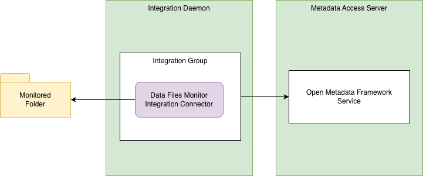

<!-- SPDX-License-Identifier: CC-BY-4.0 -->
<!-- Copyright Contributors to the ODPi Egeria project. -->

# The Basic Files Integration Connectors

The basic files integration connectors monitor changes in a file directory (folder) and update the open metadata
repository/repositories to reflect the changes to both the files and folders underneath it.

## Data Files Monitor Integration Connector

The **DataFilesMonitorIntegrationConnector** maintains a DataFile asset for each file in the directory (or any subdirectory).
When a new file is created, a new DataFile asset is created.  If a file is modified, the lastModified property
of the corresponding DataFile asset is updated.  When a file is deleted, its corresponding DataFile asset is also deleted.

Specifically:

- A [`DataFile`](https://egeria-project.org/types/2/0220-files-and-folders/#datafile) asset is created and then maintained for each file in the folder (or any sub-folder).
- When a new file is created, a new `DataFile` asset is created.
- If a file is modified, the `lastModified` property of the corresponding `DataFile` asset is updated.
- When a file is deleted, its corresponding `DataFile` asset is either:
    - Archived: this means the asset is no longer returned on standard metadata searches, but it is still visible in [lineage graphs](https://egeria-project.org/concepts/lineage). This is the default behavior.
    - Deleted: this means that all metadata associated with the data file is removed. Only use this option if lineage is not important for these file.
- A [`FileFolder`](https://egeria-project.org/types/2/0220-files-and-folders) metadata asset for the monitored folder is created when the first file is catalogued, if it does not already exist.

> **Figure 1:** Operation of the data files monitor integration connector

This connector runs in the [integration daemon](https://egeria-project.org/concepts/integration-daemon).

## Data Folder Monitor Integration Connector

The **DataFolderMonitorIntegrationConnector** maintains a DataFolder asset for the directory.  The files and directories
underneath it are assumed to be elements/records in the DataFolder asset, and so each time there is a change to the
files and directories under the monitored directory, it results in an update to the lastModified property
of the corresponding DataFolder asset.

> **Figure 2:** Operation of the data folder monitor integration connector

This connector runs in the [integration daemon](https://egeria-project.org/concepts/integration-daemon).

## Open Metadata Archive (OMARCHIVE) Files Monitor Integration Connector

The **OMArchiveFilesMonitorIntegrationConnector** monitors the changes to omarchive files in a file directory (folder)
and updates the open metadata repository/repositories to reflect the changes these files.
The connector extends the DataFilesMonitorIntegrationConnector to extract information from the archive's header to
augment the information used to catalog the file.

> **Figure 3:** Operation of the open metadata archive files monitor integration connector

## Secrets Store Files Monitor Integration Connector

The **SecretsStoreFilesMonitorIntegrationConnector** monitors the changes to secrets store files in a file directory (folder)
and updates the open metadata repository/repositories to reflect the changes these files.
The connector extends the DataFilesMonitorIntegrationConnector to extract information from the secrets store to
augment the information used to catalog the file.  This includes the embedded secrets collections, user accounts,
security lists, and security access controls.

## Deployment and configuration

The jar files for the basic files integration connectors are included in the main Egeria assembly.
They are 

----
* Return to [Integration Connectors module](..)

----
License: [CC BY 4.0](https://creativecommons.org/licenses/by/4.0/),
Copyright Contributors to the ODPi Egeria project.