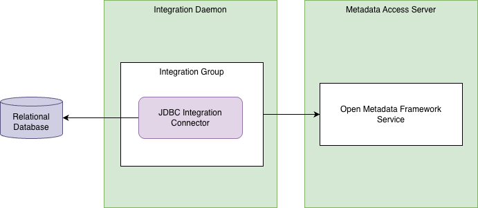
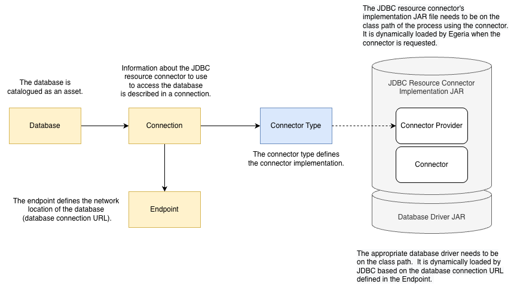

<!-- SPDX-License-Identifier: CC-BY-4.0 -->
<!-- Copyright Contributors to the ODPi Egeria project. -->

# JDBC Integration Connector

Catalogs a database via JDBC, extracting catalogs, schemas and the following table types: "TABLE", "VIEW", "FOREIGN TABLE" and "MATERIALIZED VIEW". 
It will mark the primary key columns and extract the foreign key relationships.


The JDBC integration connector connects to a relational database and extracts its database schema information and catalogs it as open metadata.


> **Figure 1:** JDBC integration connector accessing a database and cataloguing its schemas in a metadata access server

It uses an embedded [JDBC Digital Resource Connector](../../data-store-connectors/jdbc-resource-connector) to access the database.

## Catalogued elements

The JDBC integration connector catalogs a database asset, database schema assets, tables, views, columns, primary and foreign keys.
(See [Open metadata types used to catalog a database](https://egeria-project.org/types/5/database) for more information)

If the endpoint information is available, it will also attach the connection information to access the database through the [JDBC Digital Resource Connector](https://egeria-project.org/connectors/resource/jdbc-resource-connector).


> **Figure 2:** Connection information attached to catalogued database enables consumers of the database to get access to the database contents

## Configuration

This connector runs in the [Integration Daemon](https://egeria-project.org/concepts/integration-daemon).

This is its connection definition to use on the [administration commands that configure the integration daemon](https://egeria-project.org/guides/admin/servers/by-server-type/configuring-an-integration-daemon).

```json linenums="1" hl_lines="14"
{
    "connection" : 
    {
        "class": "VirtualConnection",
        "connectorType" : 
        {
            "class": "ConnectorType",
            "connectorProviderClassName": "org.odpi.openmetadata.adapters.connectors.integration.jdbc.JdbcIntegrationConnectorProvider"
        },
        "embeddedConnections":
        [
            {
                "class" : "EmbeddedConnection",
                "embeddedConnection" :
                {
                    "class" : "Connection",
                    "userId" : " ... ",
                    "clearPassword" : " ... ",
                    "connectorType" : 
                    {
                        "class": "ConnectorType",
                        "connectorProviderClassName": "org.odpi.openmetadata.adapters.connectors.resource.jdbc.JdbcConnectorProvider"
                    },
                    "endpoint":
                    {
                        "class": "Endpoint",
                        "address" : " ... "
                    }
                }
            }
        ],
        "configurationProperties": 
        {
            "catalog" : " ... ",
            "includeSchemaNames": [],
            "excludeSchemaNames": [],
            "includeTableNames": [],
            "excludeTableNames": [],
            "includeViewNames": [],
            "excludeViewNames": [],
            "includeColumnNames": [],
            "excludeColumnNames": []
        }
    }
}
```

- `userId`: user
- `clearPassword`: password
- `address`: jdbc format address
- `catalog` (optional): null or missing means catalog will not be used during querying, empty string means objects that belong to no catalog will be queried, actual value means objects belonging to specified catalog will be queried
- `include/exclude` (optional): lists with database object names to filter out the import, no wildcards supported


