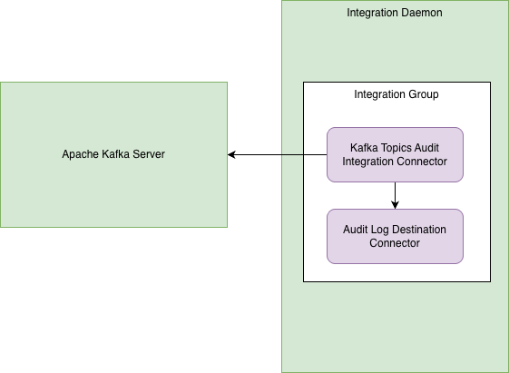

<!-- SPDX-License-Identifier: CC-BY-4.0 -->
<!-- Copyright Contributors to the Egeria project. -->

# The Kafka Audit Log Integration Connector

The Kafka Audit Log Integration Connector listens for Audit Log Records sent by an OMAG Server over Apache Kafka
to the Audit Log Destinations configured in the catalog targets.



> **Figure 1:** Operation of the kafka topics audit integration connector


## Configuration

This connector runs in the [Integration Daemon](https://egeria-project.org/concepts/integration-daemon).

This is its connection definition to use on the [administration commands that configure the integration daemon](https://egeria-project.org/guides/admin/servers/by-server-type/configuring-an-integration-daemon).

```json linenums="1" hl_lines="14"
{
   "connection" : 
                { 
                    "class" : "Connection",
                    "qualifiedName" : "TopicMonitorConnection",
                    "connectorType" : 
                    {
                        "class" : "ConnectorType",
                        "connectorProviderClassName" : "org.odpi.openmetadata.devprojects.connectors.integration.kafka.KafkaTopicsAuditIntegrationProvider"
                    },
                    "endpoint" :
                    {
                        "class" : "Endpoint",
                        "address" : "{{serverURL}}"
                    }
                }
}
```

    - Replace `{{serverURL]}` with the network address of Kafka's bootstrap server (for example, `localhost:9092`).


----
License: [CC BY 4.0](https://creativecommons.org/licenses/by/4.0/),
Copyright Contributors to the Egeria project.