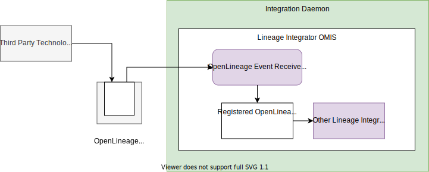
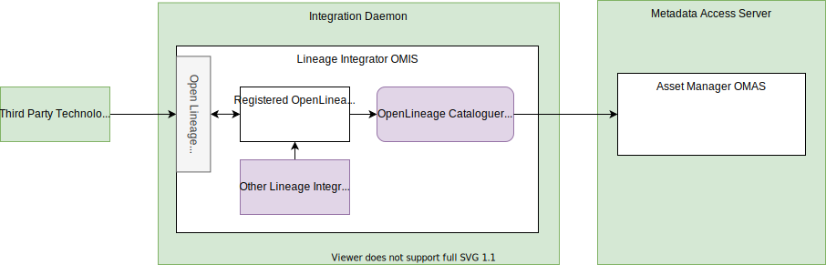
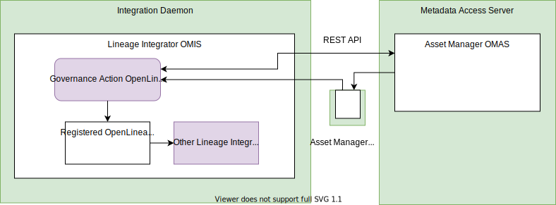
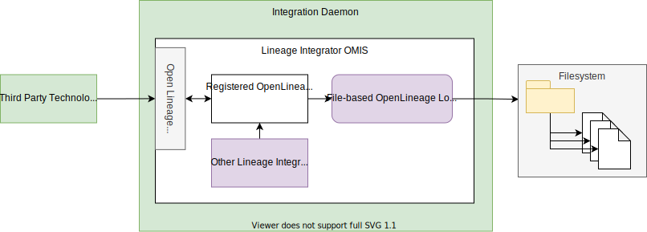
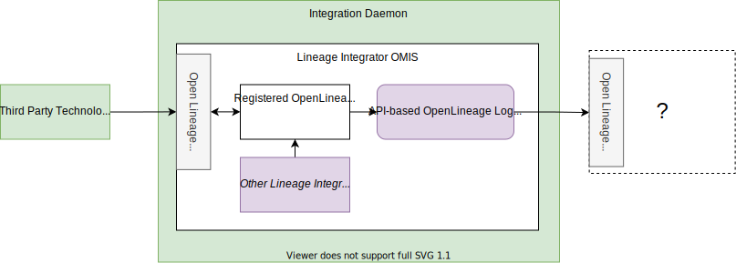

<!-- SPDX-License-Identifier: CC-BY-4.0 -->
<!-- Copyright Contributors to the ODPi Egeria project. -->

# The Open Lineage Connectors


## Open Lineage Event Receiver Integration Connector

The Open Lineage Event Receiver integration connector receives open lineage events from an event topic and publishes them to the lineage integration connectors with OpenLineage listeners registered in the same integration daemon instance.


> **Figure 1:** Operation of the Open Lineage event receiver integration connector

It uses an embedded [Open Metadata Topic Connector](https://egeria-project.org/concepts/open-metadata-topic-connector) to receive events from the topic.

### Configuration

This connector runs in the [Integration Daemon](https://egeria-project.org/concepts/integration-daemon).

The connection definition to use on the [administration commands that configure the integration daemon](https://egeria-project.org/guides/admin/servers/by-server-type/configuring-an-integration-daemon) is a *VirtualConnection* with an embedded [OpenMetadataTopicConnection](https://egeria-project.org/concepts/open-metadata-topic-connector).

```json linenums="1" hl_lines="11"
{
   "connection" : 
                { 
                    "class" : "VirtualConnection",
                    "qualifiedName" : "Egeria:IntegrationConnector:Lineage:OpenLineageEventReceiver Connection",
                    "connectorType" : 
                    {
                        "class" : "ConnectorType",
                        "connectorProviderClassName" : "org.odpi.openmetadata.adapters.connectors.integration.openlineage.OpenLineageEventReceiverIntegrationProvider"
                    },
                    "embeddedConnections" : [ {{topicConnection}} ]
                }
}
```
- Add the connection for the open metadata topic connector in the `embeddedConnections` section replacing {{topicConnection}}.  This will have the topic name in the endpoint's `networkAddress`.  The example below shows the connection for the [Kafka open metadata topic connector](https://egeria-project.org/connectors/resource/kafka-open-metadata-topic-connector) which supports events from [Apache Kafka](https://kafka.apache.org/).

```json linenums="1" hl_lines="11-40"
{
   "connection" : 
                { 
                    "class" : "VirtualConnection",
                    "qualifiedName" : "Egeria:IntegrationConnector:Lineage:OpenLineageEventReceiver Connection",
                    "connectorType" : 
                    {
                        "class" : "ConnectorType",
                        "connectorProviderClassName" : "org.odpi.openmetadata.adapters.connectors.integration.openlineage.OpenLineageEventReceiverIntegrationProvider"
                    },
                    "embeddedConnections" : [
                    {
                        "class": "EmbeddedConnection",
                        "embeddedConnection" : 
                        {
                            "class": "Connection",
                            "qualifiedName": "Kafka Open Metadata Topic Connector",
                            "connectorType":
                            {
                                "class": "ConnectorType",
                                "connectorProviderClassName": "org.odpi.openmetadata.adapters.eventbus.topic.kafka.KafkaOpenMetadataTopicProvider"      
                            },
                            "endpoint":
                            {
                                "class": "Endpoint",
                                "address": {{openLineageTopicName}}
                            },
                            "configurationProperties": 
                            {
                                "producer": 
                                {
                                    "bootstrap.servers": {{kafkaEndpoint}}
                                },
                                "local.server.id": "{{localServerId}}",
                                "consumer":
                                {
                                    "bootstrap.servers": {{kafkaEndpoint}}
                                }
                            }
                        }
                    }]
                }
}
```

- Add the name of the topic in {{openLineageTopicName}}; the integration daemon's server id in {{localServerId}} and the endpoint for Apache Kafka (for example localhost:9092) in {{kafkaEndpoint}}.


## Open Lineage Cataloguer Integration Connector

The Open Lineage Cataloguer integration connector registers an OpenLineage listener with the integration daemon context and catalogues any processes described in the OpenLineage events it received that are not already known to the open metadata ecosystem.


> **Figure 2:** Operation of the Open Lineage cataloguer integration connector


### Configuration

This connector runs in the [Integration Daemon](https://egeria-project.org/concepts/integration-daemon).

This is its connection definition to use on the [administration commands that configure the integration daemon](https://egeria-project.org/guides/admin/servers/configuring-an-integration-daemon).

```json linenums="1" hl_lines="14"
{
   "connection" : 
                { 
                    "class" : "Connection",
                    "qualifiedName" : "Egeria:IntegrationConnector:Lineage:OpenLineageCataloguer Connection",
                    "connectorType" : 
                    {
                        "class" : "ConnectorType",
                        "connectorProviderClassName" : "org.odpi.openmetadata.adapters.connectors.integration.openlineage.OpenLineageCataloguerIntegrationProvider"
                    }
                }
}
```

## Governance Action Open Lineage Integration Connector

The Governance Action Open Lineage integration connector listens for governance actions executing in the open metadata ecosystem and generates open lineage events for them and publish them to any integration connector running in the same integration daemon instance.


> **Figure 3:** Operation of the File-based Open Lineage log store integration connector


### Configuration

This connector runs in the [Integration Daemon](https://egeria-project.org/concepts/integration-daemon).

This is its connection definition to use on the [administration commands that configure the Lintegration daemon](https://egeria-project.org/guides/admin/servers/by-server-type/configuring-an-integration-daemon).

```json linenums="1" hl_lines="14"
{
   "connection" : 
                { 
                    "class" : "Connection",
                    "qualifiedName" : "Egeria:IntegrationConnector:Lineage:GovernanceActionOpenLineage Connection",
                    "connectorType" : 
                    {
                        "class" : "ConnectorType",
                        "connectorProviderClassName" : "org.odpi.openmetadata.adapters.connectors.integration.openlineage.GovernanceActionOpenLineageIntegrationProvider"
                    }
                }
}
```

## File-based Open Lineage Log Store Integration Connector

The File-based Open Lineage Log Store integration connector stores open lineage events to the file system.


> **Figure 4:** Operation of the File-based Open Lineage log store integration connector


### Configuration

This connector runs in the [Integration Daemon](https://egeria-project.org/concepts/integration-daemon).

This is its connection definition to use on the [administration commands that configure the integration daemon](https://egeria-project.org/guides/admin/server/configuring-an-integration-daemon/).

```json linenums="1" hl_lines="14"
{
   "connection" : 
                { 
                    "class" : "Connection",
                    "qualifiedName" : "Egeria:IntegrationConnector:Lineage:FileBasedOpenLineageLogStore Connection",
                    "connectorType" : 
                    {
                        "class" : "ConnectorType",
                        "connectorProviderClassName" : "org.odpi.openmetadata.adapters.connectors.integration.openlineage.FileBasedOpenLineageLogStoreProvider"
                    },
                    "endpoint" :
                    {
                        "class" : "Endpoint",
                        "address" : "{{folderName}}"
                    }
                }
}
```

- Replace `{{folderName}}` with the path name of the folder where the files will be located.

## API-based Open Lineage Log Store Integration Connector


The API-based Open Lineage Log Store integration connector calls an OpenLineage compliant API to store open lineage events that have been published to the integration daemon instance where this connector is running.


> **Figure 5:** Operation of the API-based Open Lineage log store integration connector


### Configuration

This connector runs in the [Integration Daemon](https://egeria-project.org/concepts/integration-daemon).

This is its connection definition to use on the [administration commands that configure the integration daemon](https://egeria-project.org/guides/admin/configuring-an-integration-daemon/).

!!! example "Connection configuration"
```json linenums="1" hl_lines="14"
{
   "connection" : 
                { 
                    "class" : "Connection",
                    "qualifiedName" : "Egeria:IntegrationConnector:Lineage:APIBasedOpenLineageLogStore Connection",
                    "connectorType" : 
                    {
                        "class" : "ConnectorType",
                        "connectorProviderClassName" : "org.odpi.openmetadata.adapters.connectors.integration.openlineage.APIBasedOpenLineageLogStoreProvider"
                    },
                    "endpoint" :
                    {
                        "class" : "Endpoint",
                        "address" : "{{logStoreURL}}"
                    }
                }
}
```

    - Replace `{{logStoreURL}}` with the URL of the destination API.


----
* Return to [Integration Connectors module](..)

----
License: [CC BY 4.0](https://creativecommons.org/licenses/by/4.0/),
Copyright Contributors to the ODPi Egeria project.