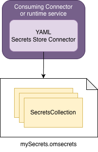
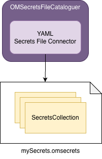

<!-- SPDX-License-Identifier: CC-BY-4.0 -->
<!-- Copyright Contributors to the ODPi Egeria project. -->

# The YAML File Secrets Connectors

The *YAML File Secrets Connectors* are used to retrieve secrets from a YAML file.
The structure of this store is described in the `SecretsStore` java class found in the `secretsstore` package.
The secrets store is organized into named collections.
Each collection represents the related secrets needed by a particular type of caller.

Inside a collection are:

* A refresh time interval (`refreshTimeInterval`) that defines how long the secrets can be cached.  When the time expires, the connector retrieves the secrets from the cache.
* A map of named secrets (`secrets`) - such as details of certificates or userId and passwords.  These secrets are used by other connectors, and automated services to log on to remote services.
* The details of an API to call to retrieve a token (`tokenAPI`).  This includes the HTTP request type, URL and details fo the request and response body.  This supplements the secrets map allowing certain secrets to be retrieved dynamically.
* A map of userIds to user account details (`users`).  This is needed by a connector that is supporting a user authentication service.
* A map of named lists (`namedLists`) that is used to represent organizational units, security roles and groups needed by an authorization service.
* Security access controls (`securityAccessControls`) that are used by an authorization service to control access to open metadata.

Complete details of this structure can be found in [Egeria's Javadoc](https://odpi.github.io/egeria/org/odpi/openmetadata/adapters/connectors/secretsstore/yaml/secretsstore/package-summary.html) and an example can be found in [GitHub](https://github.com/odpi/egeria/tree/main/open-metadata-resources/open-metadata-deployment/secrets).

## YAML File Secrets Store Connector

The *YAML File Secrets Store Connector* is the connector used to access secrets in the Egeria runtime. 
This connector can only access a single secrets collection. The name of this secrets collection is specified in the configuration properties.
It is a [Secrets Store Connector](https://egeria-project.org/concepts/secrets-store-connector/)


> **Figure 1:** Operation of the YAML Secrets Store Connector

The location of the YAML File is configured in the endpoint of the connector's connection object.
The collection to use is supplied in the `secretsCollectionName` property found in the connection's `configurationProperties`.  
The connector will fail if either of these two values are missing.

### Configuration

This is its connection definition to embed into a calling connector's connection object.

```json linenums="1" hl_lines="14"
{
    "connection" : 
    { 
        "class" : "Connection",
        "qualifiedName" : "Egeria:SecretsStoreConnector:YAML File Connection",
        "connectorType" : 
        {
            "class" : "ConnectorType",
            "connectorProviderClassName" : "org.odpi.openmetadata.adapters.connectors.secretsstore.yaml.YAMLSecretsStoreProvider"
        },
        "endpoint" :
        {
            "class" : "Endpoint",
            "address" : {{secretsStoreFileLocation}}
        },
        "configurationProperties" :
        {
            "secretsCollectionName" : {{secretsCollectionName}}
        }
    }
}
```
> Connection configuration for the yaml file secrets store connector

## YAML File Secrets File Connector

The *YAML File Secrets File Connector* is the connector used to all secrets collection in the secrets file.  It us used for cataloguing the secrets collections in the secrets file.


> **Figure 2:** Operation of the YAML Secrets File Connector

The location of the YAML File is configured in the endpoint of the connector's connection object.
The connector will fail if this value is missing.

### Configuration

This is its connection definition to embed into a calling connector's connection object.

```json linenums="1" hl_lines="14"
{
    "connection" : 
    { 
        "class" : "Connection",
        "qualifiedName" : "Egeria::FileConnector::YAMLSecretsStoreFile",
        "connectorType" : 
        {
            "class" : "ConnectorType",
            "connectorProviderClassName" : "org.odpi.openmetadata.adapters.connectors.secretsstore.yaml.YAMLSecretsFileProvider"
        },
        "endpoint" :
        {
            "class" : "Endpoint",
            "address" : {{secretsStoreFileLocation}}
        }
    }
}
```
> Connection configuration for the yaml file secrets file connector

----
* Return to [Secrets Store Connectors module](..)

----
License: [CC BY 4.0](https://creativecommons.org/licenses/by/4.0/),
Copyright Contributors to the ODPi Egeria project.