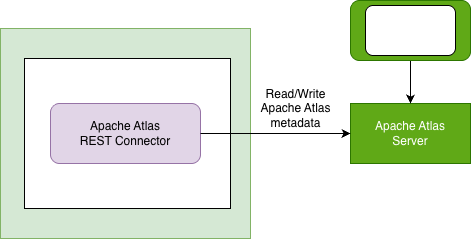

<!-- SPDX-License-Identifier: CC-BY-4.0 -->
<!-- Copyright Contributors to the Egeria project. -->

# Apache Atlas Connectors

[Apache Atlas](https://atlas.apache.org) is a metadata catalog originally designed for the Hadoop ecosystem.  It offers integration services called Hooks and Bridges to capture the schemas and data sets of data platforms such as [Apache Hive](https://hive.apache.org/), [Apache HBase](https://hbase.apache.org/) and [Apache Hadoop Distributed File System (HDFS)](https://hadoop.apache.org/docs/stable/hadoop-project-dist/hadoop-hdfs/HdfsUserGuide.html) along with the processes for creating and maintaining data sets on these platforms.  The metadata descriptions of these data sets and processes are linked together using lineage relationships, allowing an understanding of how data is flowing through a Hadoop deployment.  Apache Atlas also supports glossaries and a tagging system that can be used both in searches and to control access to data through Apache Ranger (using the TagSync integration).

In recent years, Apache Atlas has been embedded in popular data catalogs such as [Microsoft Purview](https://azure.microsoft.com/en-gb/products/purview/) and [Atlan](https://atlan.com/) increasing the interest in being able to integrate with this metadata catalog.

The Apache Atlas connectors provide a variety of functions to access, survey, catalog and govern Apache Atlas.
The Jar file *apache-atlas-connectors.jar* is included in the OMAG Server Platform.

## Apache Atlas REST Connector

The [Apache Atlas REST Connector](docs/apache-atlas-rest-connector.md) is a digital resource connector that has a REST API that allows external callers to query and create both
types and instances.  This connector provides a simple Java API to this REST API.
It is written without any dependencies on Apache Atlas (or its associated Hadoop components)
so it happily runs in the same version of Java as the rest of Egeria.

This connector is used by other connectors from Egeria, and may also be used
by components from outside Egeria.

The values from the connection used by this connector are:

* Connection.getUserId() and Connection.getClearPassword() for logging in to Apache Atlas.
* Connection.getDisplayName() for the connector name in messages.
* Connection.getEndpoint().getAddress() for the URL root (typically host and port name) of the Apache Atlas server.
* Connection.getConfigurationProperties.get("atlasServerName") for the name of the Apache Atlas server to use in messages.

> **Figure 1:** Operation of the Apache Atlas REST Connector

This connector is called by the other Atlas Connectors.

## The Apache Atlas Survey Connector

The [Apache Atlas Survey Connector](docs/apache-atlas-survey-action-service.md) reviews the status and content of an Apache Atlas server and documents it in a survey report.

## The Apache Atlas Integration Connector

The [Apache Atlas integration connector](docs/apache-atlas-catalog-integration-connector.md) publishes glossary terms, assets and lineage to Apache Atlas.

### Deployment and configuration

The Apache Atlas integration connector is included in the main Egeria assembly: omag-server-platform.
It runs in the [integration daemon](https://egeria-project.org/concepts/integration-daemon/).

----
License: [CC BY 4.0](https://creativecommons.org/licenses/by/4.0/),
Copyright Contributors to the Egeria project.