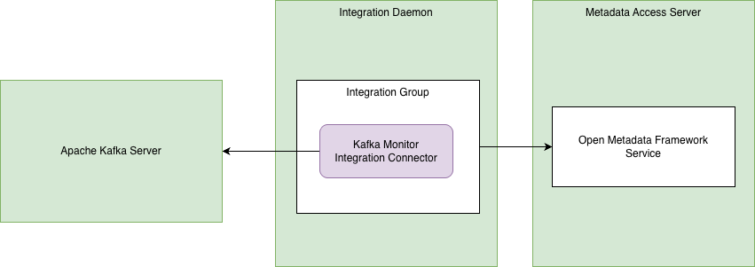

<!-- SPDX-License-Identifier: CC-BY-4.0 -->
<!-- Copyright Contributors to the Egeria project. -->

# Apache Kafka Connectors

## Kafka Monitor Integration Connector

The kafka monitor integration connector monitors an [Apache Kafka](https://kafka.apache.org/) server and creates a [KafkaTopic](https://egeria-project.org/types/2/0223-Events-and-Logs) asset for each topic that is known to the server. If the topic is removed from the Apache Kafka Server, its corresponding KafkaTopic asset is also removed.


> **Figure 1:** Operation of the kafka monitor integration connector


### Configuration

This connector runs in the [Integration Daemon](https://egeria-project.org/concepts/integration-daemon).

This is its connection definition to use on the [administration commands that configure the Integration Daemon](https://egeria-project.org/guides/admin/servers/by-server-type/configuring-an-integration-daemon).

!!! example "Connection configuration"
```json linenums="1" hl_lines="14"
{
   "connection" : 
                { 
                    "class" : "Connection",
                    "qualifiedName" : "TopicMonitorConnection",
                    "connectorType" : 
                    {
                        "class" : "ConnectorType",
                        "connectorProviderClassName" : "org.odpi.openmetadata.adapters.connectors.integration.kafka.KafkaMonitorIntegrationProvider"
                    },
                    "endpoint" :
                    {
                        "class" : "Endpoint",
                        "address" : "{{serverURL}}"
                    }
                }
}
```

    - Replace `{{serverURL]}` with the network address of Kafka's bootstrap server (for example, `localhost:9092`).
